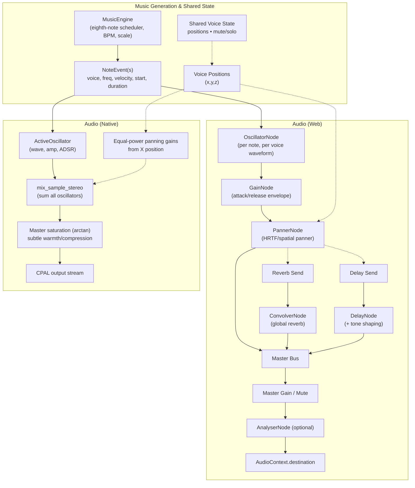

## Audio Pipelines (Web and Native)

The diagrams below summarize how musical events are generated and rendered to audio on both web and native builds. They reflect the current implementation described in `docs/SPEC.md` and the code in `crates/app-core`, `crates/app-web`, and `crates/app-native`.

Notes:

- Web uses Web Audio nodes for envelope, spatialization, and buses (reverb, delay). An `AnalyserNode` is optional.
- Native uses `cpal` output; oscillators are mixed with equal-power stereo panning from voice X and subtle master saturation.
