## Audio Pipeline

The diagram below summarizes how musical events are generated and rendered to audio in the app. It reflects the current implementation described in `docs/SPEC.md` and the code in this crate (with the shared engine under `src/core`).

```mermaid
graph TD
  %% Audio pipeline (Web)
  subgraph "Music Generation & Shared State"
    A["MusicEngine\n(eighth-note scheduler, BPM, scale)"]
    B["Shared Voice State\npositions • mute/solo"]
    A --> C["NoteEvent(s)\nvoice, freq, velocity, start, duration"]
    B -.-> D["Voice Positions\n(x,y,z)"]
  end

  %% Web Audio path
  subgraph "Audio"
    %% Per-note source and per-voice strip
    C --> N1["OscillatorNode\n(per-note, per-voice waveform)"]
    N1 --> V1["GainNode (env)\n(attack/release)"]
    V1 --> VG["Voice Gain"]
    VG --> P["PannerNode\n(HRTF positional)"]
    D -.-> P
    P --> M["Master Gain bus"]

    %% Pre-panner effect sends (per voice)
    V1 -.-> DS["Delay Send"]
    V1 -.-> RS["Reverb Send"]
    DS --> DI["Delay In"]
    RS --> RI["Reverb In"]

    %% Delay bus with feedback and tone shaping
    DI --> DL["DelayNode"]
    DL --> LT["Biquad Lowpass\n(tone)"]
    LT --> DF["Delay Feedback"]
    DF --> DL
    LT --> DW["Delay Wet"]
    DW --> M

    %% Reverb bus
    RI --> CV["ConvolverNode\n(impulse)"]
    CV --> RW["Reverb Wet"]
    RW --> M

    %% Master saturation and output (wet/dry mix)
    M --> SP["Sat Pre Gain"]
    SP --> WS["WaveShaperNode\n(arctan)"]
    WS --> SW["Sat Wet"]
    SW --> DEST["AudioContext.destination"]
    M --> SD["Sat Dry"]
    SD --> DEST

    %% Optional analyser tap (for visuals only)
    M -.-> AN["AnalyserNode (optional)"]
  end

```

Notes:

- Web uses Web Audio nodes for envelope, spatialization, and buses (reverb, delay). Effect sends are pre-panner.
- Master output applies a gentle arctan saturation with a wet/dry mix before the destination.
- An `AnalyserNode` is optional and, when used, is tapped from the master bus for visuals only (not inserted inline with audio output).

References:

- [Web Audio API overview (MDN)](https://developer.mozilla.org/en-US/docs/Web/API/Web_Audio_API)
- [AudioContext (MDN)](https://developer.mozilla.org/en-US/docs/Web/API/AudioContext)
- [AudioParam automation (MDN)](https://developer.mozilla.org/en-US/docs/Web/API/AudioParam)
- [OscillatorNode (MDN)](https://developer.mozilla.org/en-US/docs/Web/API/OscillatorNode)
- [GainNode (MDN)](https://developer.mozilla.org/en-US/docs/Web/API/GainNode)
- [PannerNode (MDN)](https://developer.mozilla.org/en-US/docs/Web/API/PannerNode) and [AudioListener (MDN)](https://developer.mozilla.org/en-US/docs/Web/API/AudioListener)
- [ConvolverNode (MDN)](https://developer.mozilla.org/en-US/docs/Web/API/ConvolverNode)
- [DelayNode (MDN)](https://developer.mozilla.org/en-US/docs/Web/API/DelayNode)
- [BiquadFilterNode (MDN)](https://developer.mozilla.org/en-US/docs/Web/API/BiquadFilterNode)
- [WaveShaperNode (MDN)](https://developer.mozilla.org/en-US/docs/Web/API/WaveShaperNode)
- [AnalyserNode (MDN)](https://developer.mozilla.org/en-US/docs/Web/API/AnalyserNode)
