## Audio Pipeline (Web)

The diagram below summarizes how musical events are generated and rendered to audio on the web build. It reflects the current implementation described in `docs/SPEC.md` and the code in `crates/app-core` and `crates/app-web`.

```mermaid
graph TD
  %% Audio pipeline (Web)
  subgraph "Music Generation & Shared State"
    A["MusicEngine\n(eighth-note scheduler, BPM, scale)"]
    B["Shared Voice State\npositions • mute/solo"]
    A --> C["NoteEvent(s)\nvoice, freq, velocity, start, duration"]
    B -.-> D["Voice Positions\n(x,y,z)"]
  end

  %% Web Audio path
  subgraph "Audio (Web)"
    C --> W1["OscillatorNode\n(per note, per voice waveform)"]
    W1 --> W2["GainNode\n(attack/release envelope)"]
    W2 --> W3["PannerNode\n(HRTF/spatial panner)"]
    D -.-> W3
    W3 --> W4["Master Bus"]
    W3 -.-> WS1["Reverb Send"]
    WS1 --> WR["ConvolverNode\n(global reverb)"] --> W4
    W3 -.-> WS2["Delay Send"]
    WS2 --> WD["DelayNode\n(+ tone shaping)"] --> W4
    W4 --> W5["Master Gain / Mute"] --> W6["AnalyserNode (optional)"] --> W7["AudioContext.destination"]
  end
  
```

Notes:

- Web uses Web Audio nodes for envelope, spatialization, and buses (reverb, delay). An `AnalyserNode` is optional.
