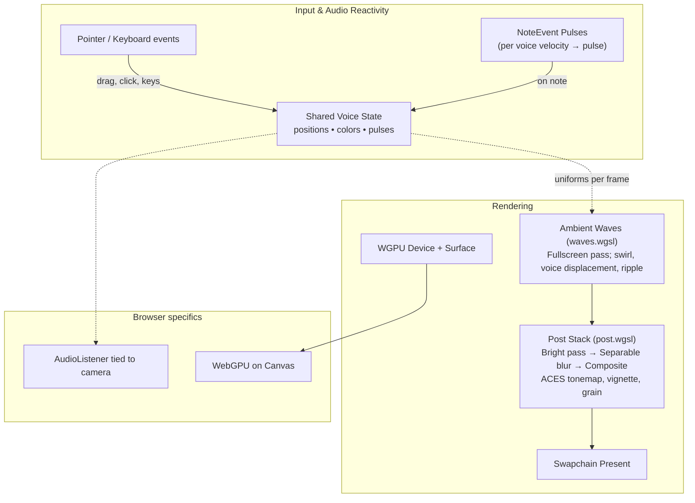

## Visual Pipeline

The diagram below summarizes the rendering flow in the app, including the ambient waves fullscreen pass and the post-processing stack.

Notes:

- `waves.wgsl` consumes voice positions and pulse to modulate displacement and highlights; pointer contributes swirl and click/tap ripple.
- `post.wgsl` implements bright-pass, separable blur and composite with ACES tonemap, vignette, grain.
- Instanced voice markers are not rendered by a separate pipeline currently; accents and highlights are integrated into `waves.wgsl` using per-voice uniforms.

References:

- [WebGPU API overview (MDN)](https://developer.mozilla.org/en-US/docs/Web/API/WebGPU_API)
- [wgpu crate docs](https://docs.rs/wgpu)
- [WGSL language spec](https://www.w3.org/TR/WGSL/)
