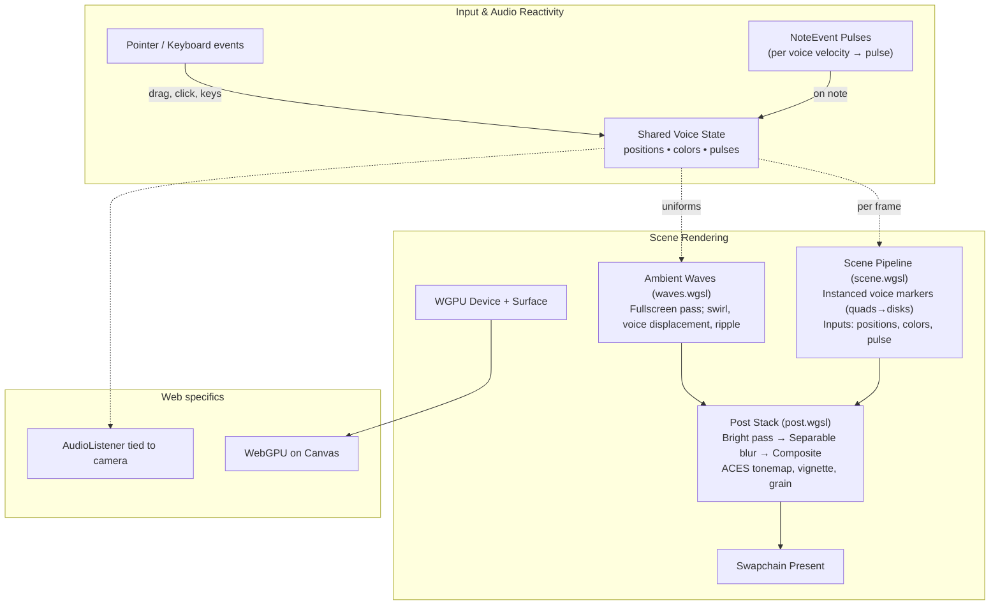

## Visual Pipeline (Web)

The diagram below summarizes the rendering flow for the web build, including the ambient waves background and the post-processing stack.

Notes:

- `waves.wgsl` consumes voice positions and pulse to modulate displacement and highlights; pointer contributes swirl and click/tap ripple.
- `post.wgsl` implements bright-pass, separable blur and composite with ACES tonemap, vignette, grain.
- Instanced voice markers are rendered with `scene.wgsl`, using per-instance position, color, and pulse.
